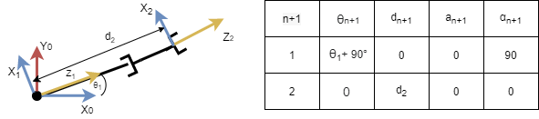
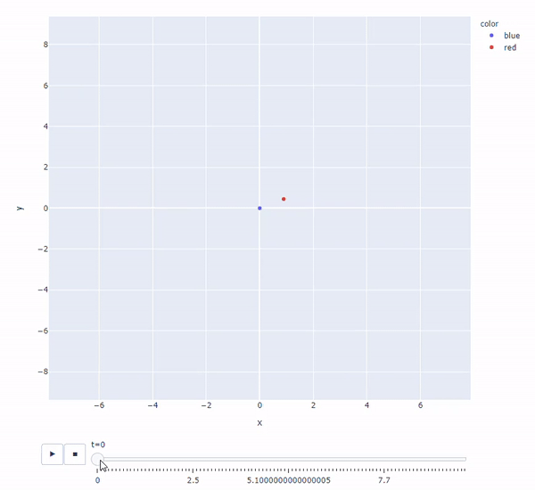

## Simple RR robot



To model this robot, we need only 2 parameters, theta1,d2

Since these values require and offset, we can create them using the `FrameParameters.from_2d_array` which takes a 2darray (2x4) in which the first row is the symbols, and the 2nd row their offsets (+/- values)

```python3
frame_1_array = [["t1",0,0,90],[90,0,0,0]]
frame1 = FrameParameters.from_2d_array(frame_1_array)
frame2 = FrameParameters.without_offset(0,"d2",0,0)
```

here `t1` and `t2` will be interpreted as symbols, to be varied by the simulator

we can then set up the Robot by adding these frames
```python3
robot = Robot()
robot.add_frame(frame1)
robot.add_frame(frame2)
```

And finally, all we need to do is initialize the simulator, set initial positions, and the velocities of the joint variables. In this case, joint one is in radians/sec, and joint 2 is in m/s
```python3
RS = RobotSimulator(robot)

joint_initial_states = {"t1":0,"d2":1}
joint_velocities = {"t1":1,"d2":1}

RS.simulate(joint_initial_states,joint_velocities,100,.1)
```

After that, we can save the data to a csv, or create an animation using plotly
```python3
# save to file
RS.write_data_to_csv("simplePR.csv")

# run plotly, and show the robots x and y positions
RS.plot_data({"x":"x","y":"y"})
```
## Result
