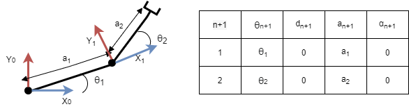
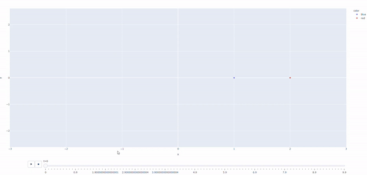

## Simple RR robot



To model this robot, we need only 4 parameters, theta1,theta2,a1,a2

We are assuming that a1,a2 are constants, so for this example they are set to 1

We can create these frames using the `FrameParameter.without_offset` method

```python3
frame1 = FrameParameters.without_offset("t1",0,1,0)
frame2 = FrameParameters.without_offset("t2",0,1,0)
```

here `t1` and `t2` will be interpreted as symbols, to be varied by the simulator

we can then set up the robot by adding these frames
```python3
robot = Robot()
robot.add_frame(frame1)
robot.add_frame(frame2)
```

And finally, all we need to do is set initial positions, and the velocities of the joint variables. In this case, since both joints are revolute, both are in radians / second
```python3
RS = RobotSimulator(robot)

joint_initial_states = {"t1":0,"t2":0}
joint_velocities = {"t1":1,"t2":1} # velocities in radians/sec

RS.simulate(joint_initial_states,joint_velocities,100,.1)
```

After that, we can save the data to a csv, or create an animation using plotly
```python3
# save to file
RS.write_data_to_csv("simpleRR.csv")

# run plotly, and show the robots x and y positions
RS.plot_data({"x":"x","y":"y"})
```
## Result
